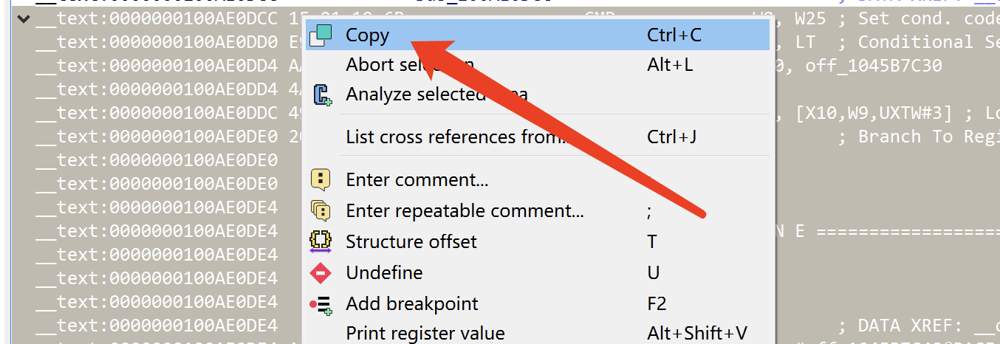
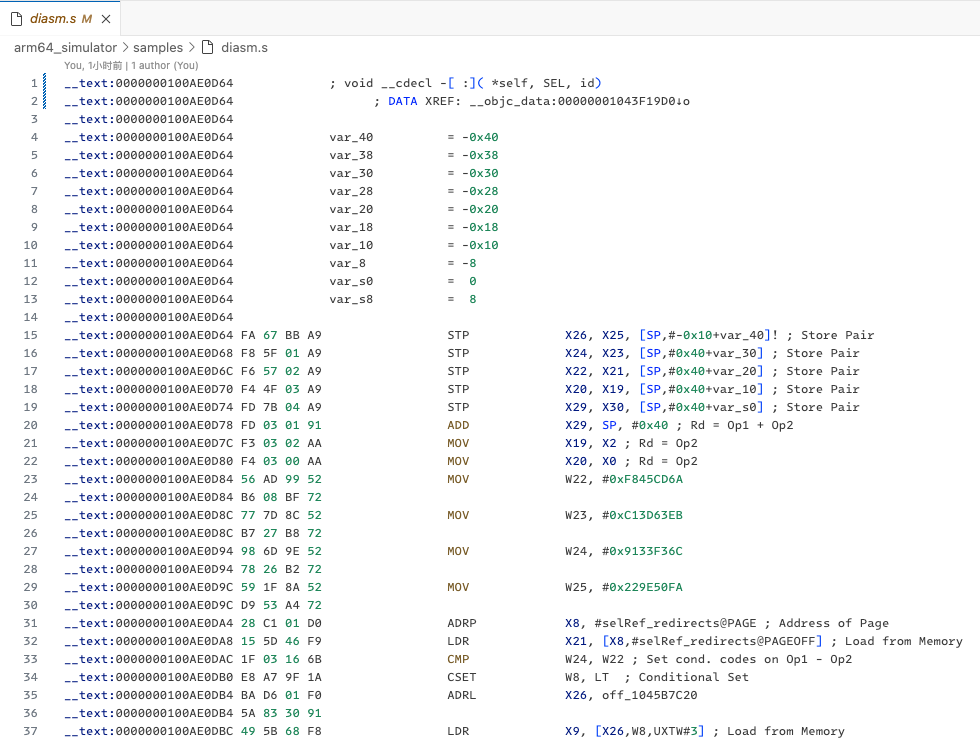
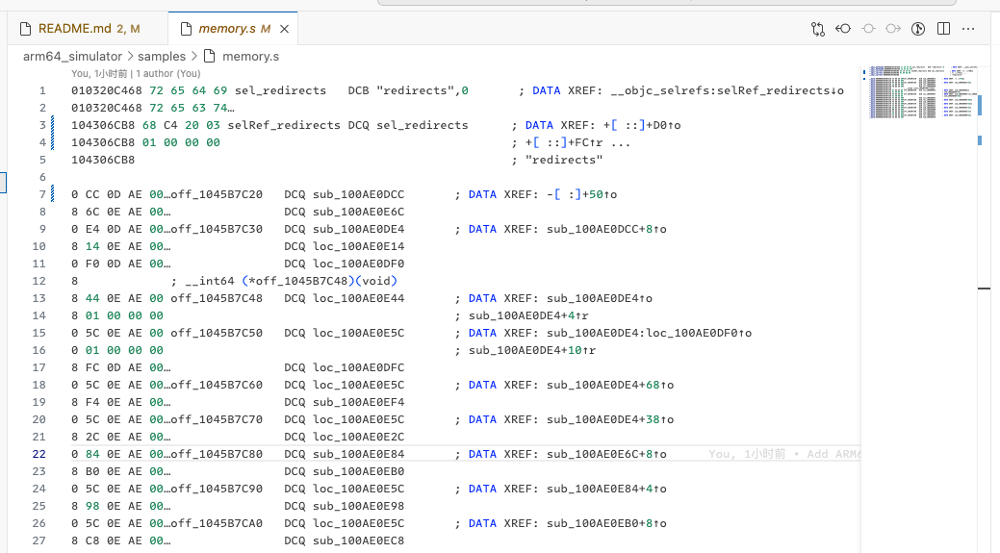
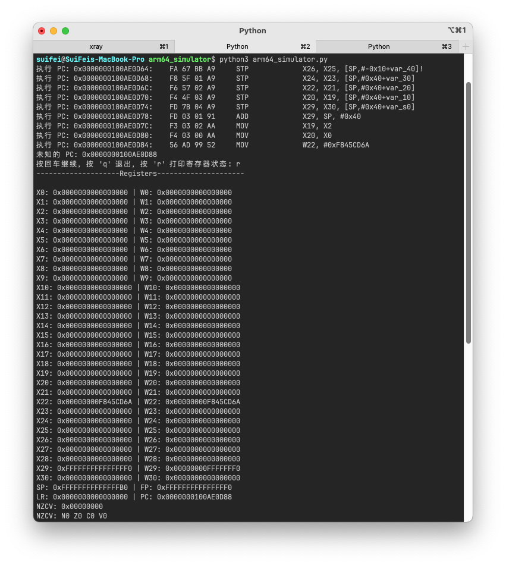
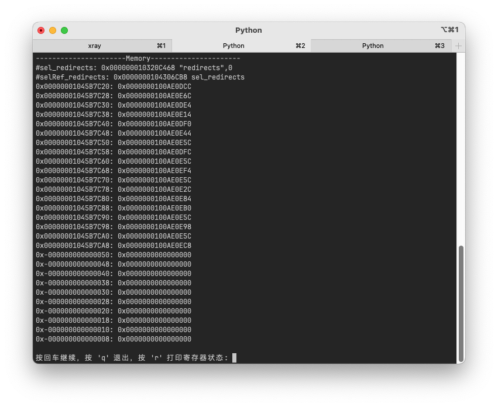
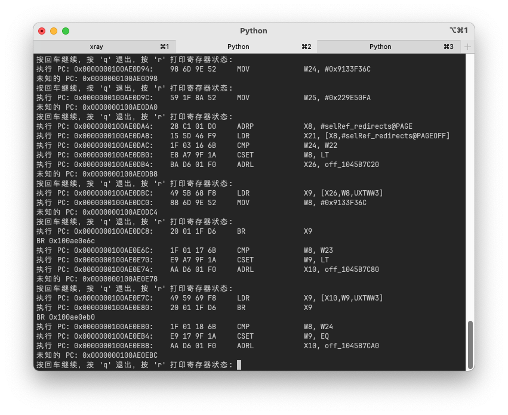

# ARM64 Assembly Simulator

[](https://GitHub.com/suifei/arm64-assembly-simulator)
[](https://GitHub.com/suifei/arm64-assembly-simulator/stargazers/)
[](https://GitHub.com/suifei/arm64-assembly-simulator/watchers/)
[](https://GitHub.com/suifei/arm64-assembly-simulator/network/)
[](https://github.com/suifei?tab=followers)
[](https://twitter.com/csuifei)

[](https://github.com/suifei/arm64-assembly-simulator)
[](https://www.python.org/)
[](https://github.com/psf/black)
[](https://github.com/suifei/arm64-assembly-simulator)
[](https://github.com/suifei/arm64-assembly-simulator)
[](https://github.com/suifei/arm64-assembly-simulator)
[](https://GitHub.com/suifei/arm64-assembly-simulator/tags/)
[](https://github.com/suifei/arm64-assembly-simulator/graphs/commit-activity)
[](https://github.com/suifei/arm64-assembly-simulator/commits)
[](https://GitHub.com/suifei/arm64-assembly-simulator/graphs/contributors/)
[](https://github.com/suifei/arm64-assembly-simulator/issues)
[](https://github.com/suifei/arm64-assembly-simulator/issues?q=is%3Aissue+is%3Aclosed)
[](https://github.com/suifei/arm64-assembly-simulator/pulls)
[](https://github.com/suifei/arm64-assembly-simulator/pulls?q=is%3Apr+is%3Aclosed)
[](https://github.com/suifei/arm64-assembly-simulator/blob/master/LICENSE)

A lightweight ARM64 assembly code and memory simulator designed to parse and execute ARM64 assembly instructions from `.s` files, typically generated by IDA Pro's disassembly.

[[中文说明]](README_zh.md) [[English]](README.md)

## Table of Contents
- [ARM64 Assembly Simulator](#arm64-assembly-simulator)
  - [Table of Contents](#table-of-contents)
  - [Overview](#overview)
  - [Features](#features)
  - [Use Cases](#use-cases)
  - [Getting Started](#getting-started)
    - [Prerequisites](#prerequisites)
    - [Installation](#installation)
    - [Usage](#usage)
    - [Configuration](#configuration)
    - [Additional Examples and Source Code](#additional-examples-and-source-code)
  - [Contributing](#contributing)
  - [License](#license)
  - [Author](#author)

## Overview

This repository contains a lightweight ARM64 assembly code and memory simulator designed to parse and execute ARM64 assembly instructions from `.s` files, typically generated by IDA Pro's disassembly. It's an ideal tool for those looking to understand the behavior of ARM64 instructions, particularly useful for educational purposes, security analysis, and performance tuning.

## Features

- **Lightweight and Standalone**: Easy to deploy and run without heavy dependencies.
- **Direct Parsing from IDA Outputs**: Seamlessly integrates with disassembly files generated by IDA Pro.
- **Detailed Execution Trace**: Tracks and displays changes in register and memory states after each instruction execution.
- **Support for Step-by-step and Continuous Execution**: Offers flexibility in instruction execution to cater to different analysis needs.
- **Simulates Register and Memory Operations**: Enhances understanding of ARM64 operations through practical simulation.
- **Extensibility**: Supports custom pre- and post-execution hooks, allowing the insertion of custom logic before and after instruction execution.

## Use Cases

- **Educational Tool**: Helps in learning and teaching the structure and applications of the ARM64 instruction set.
- **Prototyping and Testing**: Allows for quick simulation of instruction effects before actual implementation.
- **Security Analysis**: Useful in analyzing how code manipulations affect program states, potentially uncovering security vulnerabilities.
- **Performance Analysis**: Assists in understanding and optimizing code that is critical for performance.

## Getting Started

### Prerequisites

Ensure you have Python 3.x installed on your machine. This simulator does not require any additional libraries for basic operations.

### Installation

Clone the repository to your local machine:

```bash
git clone https://github.com/suifei/arm64-assembly-simulator.git
cd arm64-assembly-simulator
```

### Usage

1. Place your `.s` files containing ARM64 assembly code in the `src/samples` directory.
2. Run the simulator with the following command:




```bash
cd arm64_simulator
python arm64_simulator.py
```





### Configuration

You can modify the `ARM64Simulator` class instantiation in `arm64_simulator.py` to enable step-by-step execution or verbose output, depending on your analysis needs.

1. Basic Setup and Execution:
```python
# Load assembly code and memory settings
asm_data = read_file("samples/diasm.s")
asm_code = load_asm_code(asm_data)
memory_lines = read_file("samples/memory.s")
memory_data = parse_memory_lines(memory_lines)

# Initialize the simulator
vm = ARM64Simulator(memory_data, step_pause=False, verbose=True, output_file="samples/output.s")

# Run the simulator starting from a specified PC address
vm.run(asm_code, pc=0x100AE0D64)
```
2. Using Hooks to Modify Instruction Behavior:
```python
# Define a post-execution hook to convert all CSET instructions to NOP
def nop_ops_after_hook(vm, op_name, operands):
    if op_name == "CSET":
        print(f"AFTER-HOOK# {op_name} to NOP")
        op_name = "NOP"
        operands = []
    return op_name, operands

# Set the simulator's output file
vm.set_output_file("samples/output_with_hooks.s")

# Add the hook and rerun the simulator
vm.hook_instruction(after=nop_ops_after_hook)
vm.run(asm_code, pc=0x100AE0D64)
```

### Additional Examples and Source Code
For more examples and a deeper understanding of the simulator's capabilities, please refer to the source code available in this repository. The source files contain detailed comments and diverse use cases that can help you get acquainted with advanced features and customization options.

## Contributing

Contributions are welcome! Please feel free to submit pull requests, suggest features, or report bugs.

## License

This project is licensed under the MIT License - see the [LICENSE](LICENSE) file for details.

## Author

- **c3VpZmUgQGdtYWlsIGRvdGNvbQ==**
- **QQ Group: 555354813**

Feel free to contact me for any questions or feedback related to this project.
