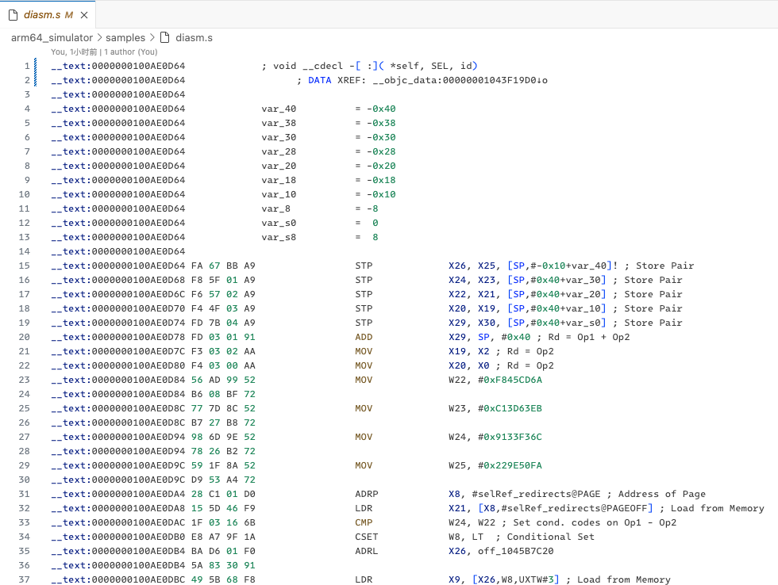
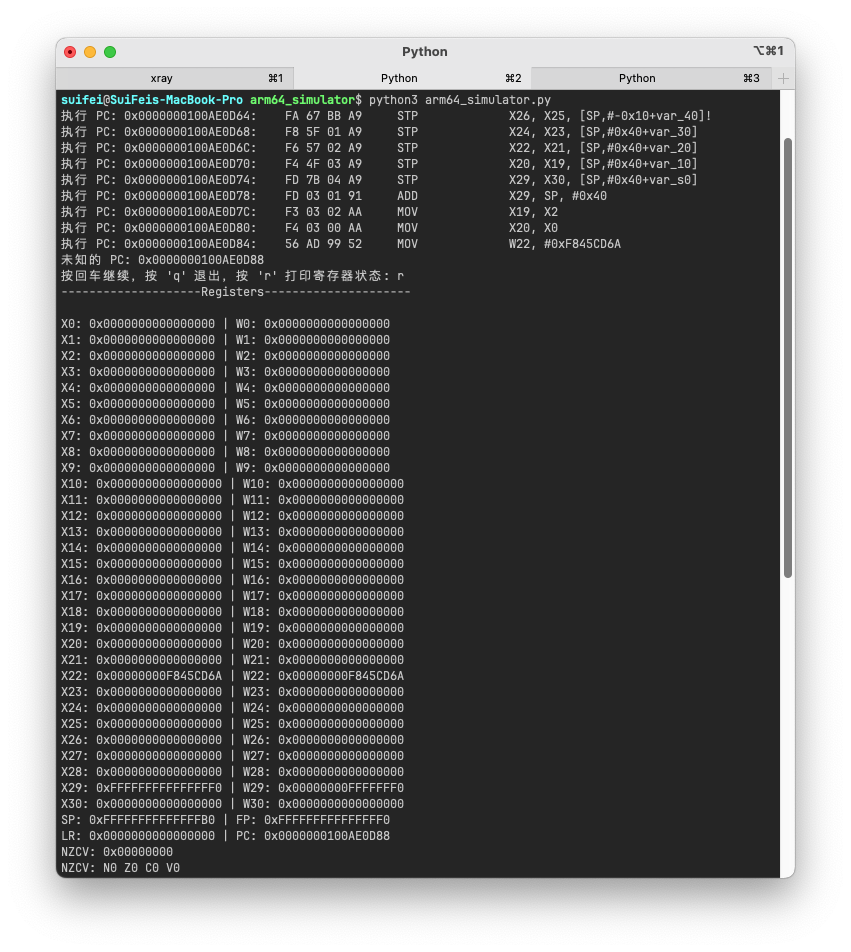
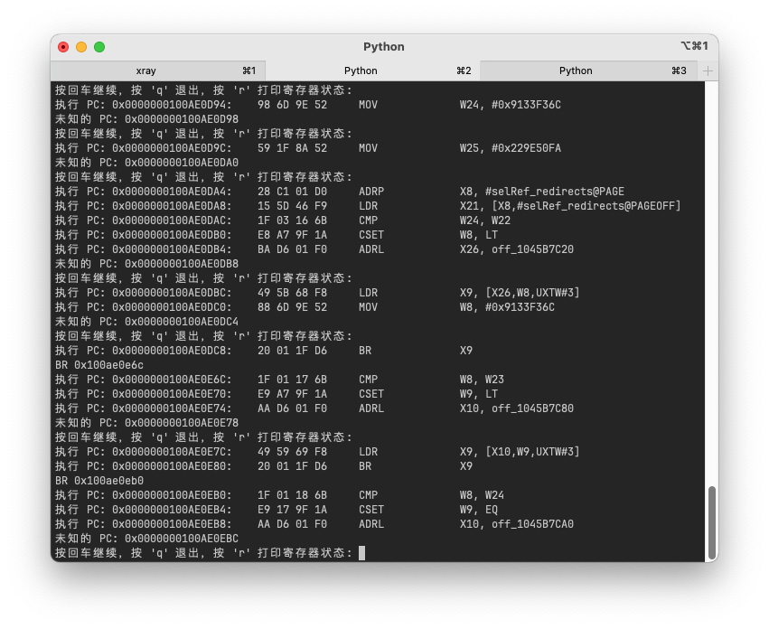

# ARM64汇编模拟器

[](https://GitHub.com/suifei/arm64-assembly-simulator/stargazers/)
[](https://GitHub.com/suifei/arm64-assembly-simulator/watchers/)
[](https://GitHub.com/suifei/arm64-assembly-simulator/network/)
[](https://github.com/suifei?tab=followers)
[](https://twitter.com/csuifei)

[](https://github.com/suifei/arm64-assembly-simulator)
[](https://www.python.org/)
[](https://github.com/psf/black)
[](https://github.com/suifei/arm64-assembly-simulator)
[](https://github.com/suifei/arm64-assembly-simulator)
[](https://github.com/suifei/arm64-assembly-simulator)
[](https://GitHub.com/suifei/arm64-assembly-simulator/tags/)
[](https://github.com/suifei/arm64-assembly-simulator/graphs/commit-activity)
[](https://github.com/suifei/arm64-assembly-simulator/commits)
[](https://GitHub.com/suifei/arm64-assembly-simulator/graphs/contributors/)
[](https://github.com/suifei/arm64-assembly-simulator/issues)
[](https://github.com/suifei/arm64-assembly-simulator/issues?q=is%3Aissue+is%3Aclosed)
[](https://github.com/suifei/arm64-assembly-simulator/pulls)
[](https://github.com/suifei/arm64-assembly-simulator/pulls?q=is%3Apr+is%3Aclosed)
[](https://github.com/suifei/arm64-assembly-simulator/blob/master/LICENSE)

一个轻量级的ARM64汇编代码和内存模拟器，用于解析和执行ARM64汇编指令，通常是由IDA Pro的反汇编生成的`.s`文件。

[[中文说明]](README_zh.md) [[English]](README.md)

## 目录
- [ARM64汇编模拟器](#arm64汇编模拟器)
  - [目录](#目录)
  - [概述](#概述)
  - [特点](#特点)
  - [用途](#用途)
  - [入门指南](#入门指南)
    - [先决条件](#先决条件)
    - [安装](#安装)
    - [使用方法](#使用方法)
    - [配置](#配置)
  - [贡献](#贡献)
  - [许可证](#许可证)
  - [作者](#作者)

## 概述

该存储库包含一个轻量级的ARM64汇编代码和内存模拟器，用于解析和执行ARM64汇编指令，通常是由IDA Pro的反汇编生成的`.s`文件。它是一个理想的工具，用于了解ARM64指令的行为，特别适用于教育目的、安全分析和性能调优。

## 特点

- **轻量级且独立**: 易于部署和运行，无需重型依赖。
- **直接从IDA输出解析**: 与IDA Pro生成的反汇编文件无缝集成。
- **详细的执行跟踪**: 跟踪并显示每个指令执行后寄存器和内存状态的变化。
- **支持逐步和连续执行**: 提供灵活的指令执行方式，以满足不同的分析需求。
- **模拟寄存器和内存操作**: 通过实际模拟增强对ARM64操作的理解。

## 用途

- **教育工具**: 帮助学习和教授ARM64指令集的结构和应用。
- **原型设计和测试**: 允许在实际实现之前快速模拟指令效果。
- **安全分析**: 用于分析代码操作如何影响程序状态，可能发现安全漏洞。
- **性能分析**: 帮助理解和优化对性能至关重要的代码。

## 入门指南

### 先决条件

确保您的计算机上安装了Python 3.x。此模拟器不需要任何额外的库进行基本操作。

### 安装

将存储库克隆到本地计算机：


```bash
git clone https://github.com/suifei/arm64-assembly-simulator.git
cd arm64-assembly-simulator
```

### 使用方法

1. 将包含ARM64汇编代码的`.s`文件放置在`src/samples`目录中。
2. 使用以下命令运行模拟器：




```bash
cd arm64_simulator
python arm64_simulator.py
```





### 配置

你可以在 `arm64_simulator.py` 文件中修改 `ARM64Simulator` 类的实例化，根据你的分析需求启用逐步执行或详细输出。

```python
simulator = ARM64Simulator(memory_data, step_pause=True, verbose=True)
simulator.run(asm_code, starting_address)
```

## 贡献

欢迎贡献！请随时提交拉取请求，建议功能，或报告错误。

## 许可证

此项目根据 MIT 许可证授权 - 请查看 [LICENSE](LICENSE) 文件了解详情。

## 作者

- **<suifei@gmail.com>**
- **QQ群: 555354813**

如果对此项目有任何问题或反馈，请随时与我联系。